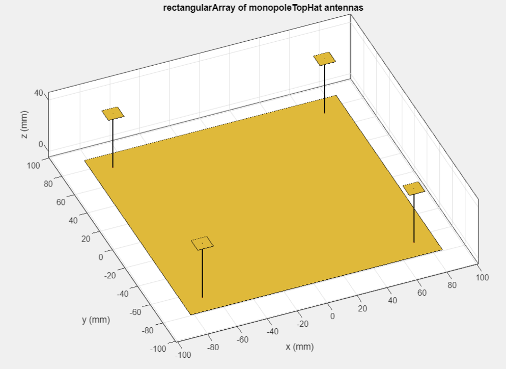
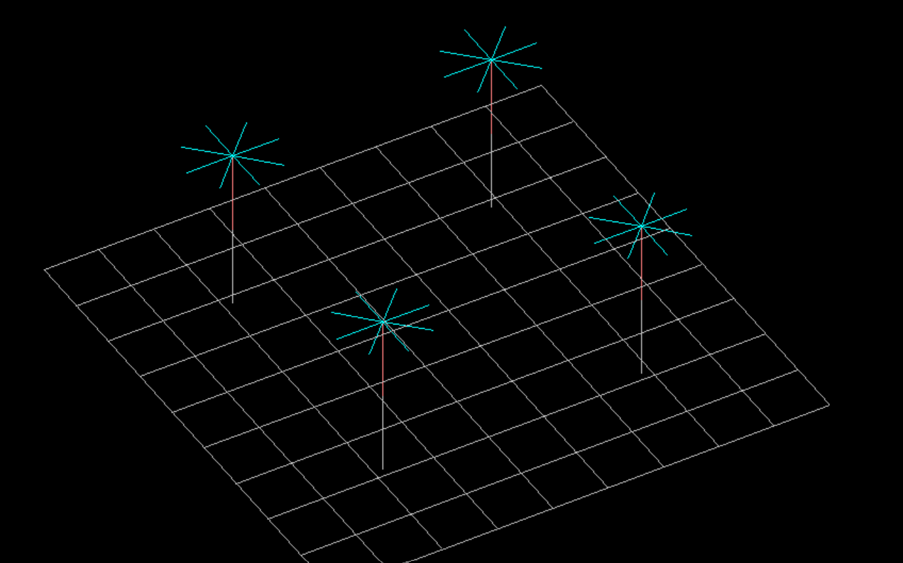

<h1>Anti-Collision Radar for UAVs</h1>

  <strong>Collaborators:</strong> Micron Avionics 
  <strong>Focus:</strong> Lightweight, low-cost radar antenna system for UAV anti-collision applications

RF Engineering

Antenna Design

UAV Systems

PCB Integration

<h2>📡 Project Overview</h2>

This project presents the design, simulation, and experimental validation of a
<strong>quad monopole antenna array</strong> integrated into a PCB for UAV anti-collision radar systems.
The design operates near <strong>1060&nbsp;MHz</strong> and employs <strong>capacitive hat monopole antennas</strong>
to significantly reduce physical antenna height while maintaining acceptable electrical performance.

The antenna array consists of <strong>one active driven element</strong> and
<strong>three passive parasitic elements</strong> to improve directivity and front-to-back ratio.

<h2>🎯 Objectives</h2>

<ul>
  <li>Design a compact monopole antenna array for UAV-mounted radar systems</li>
  <li>Reduce antenna height using capacitive hat techniques</li>
  <li>Enhance directivity and front-to-back ratio using parasitic elements</li>
  <li>Validate results through NECWinPro simulations and VNA measurements</li>
</ul>

<h2>⚙️ Technical Specifications</h2>

<table>
  <tr><th>Parameter</th><th>Value</th></tr>
  <tr><td>Operating Frequency</td><td>1060&nbsp;MHz (design), 889&nbsp;MHz (measured)</td></tr>
  <tr><td>Wavelength (λ)</td><td>0.282&nbsp;m</td></tr>
  <tr><td>Quarter Wavelength</td><td>0.070&nbsp;m</td></tr>
  <tr><td>Antenna Height</td><td>λ/8 = 0.035&nbsp;m</td></tr>
  <tr><td>PCB Type</td><td>Double-sided with ground planes</td></tr>
  <tr><td>Feed Impedance</td><td>50&nbsp;Ω</td></tr>
  <tr><td>Antenna Configuration</td><td>1 active + 3 parasitic monopoles</td></tr>
  <tr><td>Capacitive Hat Type</td><td>Wire and rectangular copper patch</td></tr>
</table>

<h2>📐 Antenna Design</h2>

<h3>Key Formulas</h3>

<pre>
λ = c / f = 0.282 m
λ / 4 = 0.070 m
Monopole Height = λ / 8 = 0.035 m

Reflection Coefficient:
Γ = (ZL − Z0) / (ZL + Z0)

Return Loss:
RL = −20 log10 |Γ|
</pre>

<h3>Design Features</h3>

<ul>
  <li>Capacitive hats used to extend electrical length without increasing height</li>
  <li>Quad monopole array for directional radiation</li>
  <li>Symmetrical PCB layout with equidistant antenna placement</li>
  <li>Dual ground planes for improved radiation efficiency</li>
</ul>

<h2>🧪 Experimental Setup</h2>

<h3>Hardware</h3>

<ul>
  <li>Custom square PCB with integrated ground planes</li>
  <li>Feed antenna hole: 2.35&nbsp;mm diameter</li>
  <li>Parasitic antenna holes: 2.45&nbsp;mm diameter</li>
  <li>Wire and copper patch capacitive hat monopoles</li>
</ul>

<h3>Measurement Tools</h3>

<ul>
  <li>Vector Network Analyzer (VNA)</li>
  <li>Dream Catcher measurement software</li>
  <li>NECWinPro for electromagnetic simulation</li>
</ul>

<h2>📊 Results</h2>

<h3>Simulation Results (NECWinPro)</h3>

<ul>
  <li>VSWR: 2.68&nbsp;dB at 1060&nbsp;MHz</li>
  <li>Front-to-Back Ratio: 8&nbsp;dB</li>
  <li>Directional beam aligned with driven element</li>
</ul>

<h3>Experimental Results</h3>

<table>
  <tr><th>Metric</th><th>Measured Value</th></tr>
  <tr><td>Resonance Frequency</td><td>889&nbsp;MHz</td></tr>
  <tr><td>S11 at Resonance</td><td>-3.89&nbsp;dB</td></tr>
  <tr><td>Front-to-Back Ratio</td><td>6&nbsp;dB</td></tr>
  <tr><td>Beamwidth</td><td>180°</td></tr>
  <tr><td>Gain</td><td>~12&nbsp;dB</td></tr>
</table>

<h2>📈 Performance Comparison</h2>

<table>
  <tr><th>Parameter</th><th>Target</th><th>Achieved</th></tr>
  <tr><td>Operating Frequency</td><td>1060&nbsp;MHz</td><td>889&nbsp;MHz</td></tr>
  <tr><td>Front-to-Back Ratio</td><td>12&nbsp;dB</td><td>6&nbsp;dB</td></tr>
  <tr><td>VSWR</td><td>&lt; 2.0</td><td>2.68</td></tr>
  <tr><td>Beamwidth</td><td>N/A</td><td>180°</td></tr>
</table>

<h2>🧠 Key Findings</h2>

<ul>
  <li>Capacitive hats effectively reduced antenna height</li>
  <li>Parasitic elements improved directional performance</li>
  <li>Measured resonance shifted due to simplified modeling assumptions</li>
  <li>Wire and patch capacitive hats showed consistent resonance behavior</li>
</ul>

<h2>📂 Project Structure</h2>

<pre>
anti-collision-radar-uav/
├── docs/
├── simulations/
├── hardware/
├── measurements/
└── images/
</pre>

<h2>🖼️ Project Visuals</h2>

<h3>Directivity Profile</h3>

<h3>Antenna Array Assembly</h3>

Physical implementation of the capacitive hat monopole antennas, showing
the driven element and three parasitic elements.

<h3>Nec_win_pro_hat_monopole</h3>

<h2>🚀 Applications</h2>

<ul>
  <li>UAV anti-collision radar systems</li>
  <li>Directional RF sensing</li>
  <li>Compact airborne radar platforms</li>
  <li>UAV swarm communication</li>
</ul>

<h2>👥 Contributors</h2>

<ul>
  <li><strong>Waleed Umer</strong> – Design, simulation, and experimental validation</li>
  <li>Francis Mensah – Project partner</li>
  <li>David Thiel – Technical supervision</li>
  <li>Will Sutton – PCB design and fabrication</li>
</ul>

<h2>🔮 Future Work</h2>

<ul>
  <li>Frequency tuning for 1060&nbsp;MHz resonance</li>
  <li>Optimisation of parasitic element spacing</li>
  <li>Multi-band antenna development</li>
  <li>Integration with operational UAV radar systems</li>
  <li>Environmental and in-flight testing</li>
</ul>

<h2>📚 References</h2>

<ol>
  <li>Balanis, C. A., <em>Antenna Theory</em></li>
  <li>Pozar, D. M., <em>Microwave Engineering</em></li>
  <li>Thiel & Smith, <em>Switched Parasitic Antennas</em></li>
  <li>Johnson & Jasik, <em>Antenna Engineering Handbook</em></li>
</ol>

</body>
</html>
